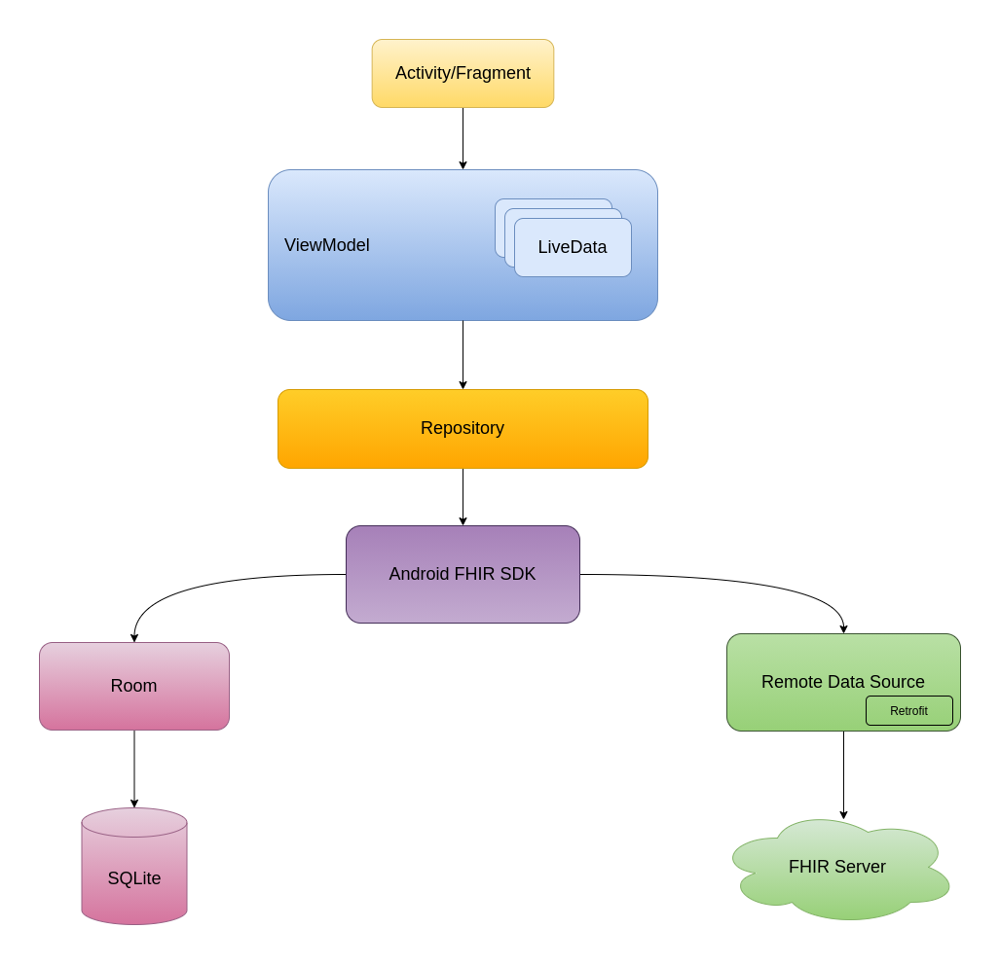

[](https://github.com/opensrp/fhircore/actions/workflows/ci.yml)
[](https://codecov.io/gh/opensrp/fhircore)
[](https://www.codacy.com/gh/opensrp/fhircore/dashboard)

# FHIR Core

<center></center>

## Getting Started

### Build setup

Begin by cloning this repository. Ensure you have JAVA 11 installed, and setup Android studio to use the Java 11 JDK for this project.

Update `local.properties` file by providing the required Keycloak credentials to enable syncing of data to and from the HAPI FHIR server:

```
OAUTH_BASE_URL=https://keycloak-stage.smartregister.org/auth/realms/FHIR_Android/
OAUTH_CIENT_ID="provide client id"
OAUTH_CLIENT_SECRET="provide client secret"
OAUTH_SCOPE=openid
FHIR_BASE_URL=https://fhir.labs.smartregister.org/fhir/
```

### App release

In order for the `assembleRelease` and/or `bundleRelease` Gradle tasks to work for instance when you need to generate a signed release version of the APK (or AAB), a keystore is required.

Generate your own release keystore using the `keytool` utility (installed as part of the java runtime) by running the following command:

```sh 
keytool -genkey -v -keystore fhircore.keystore.jks -alias <your_alias_name> -keyalg RSA -keysize 4096 -validity 1000
```

Place the Keystore file in your user(home) directory i.e. `/Users/username/fhircore.keystore.jks` for Windows or `~/fhircore.keystore.jks` for Unix based systems.

Next, create the following SYSTEM_VARIABLEs and set their values accordingly: `KEYSTORE_ALIAS`, `KEYSTORE_PASSWORD`, `KEY_PASSWORD` 

**Note:** Assign the generated keystore values to the SYSTEM_VARIABLEs listed above. Also note, if your platform doesn't prompt you for a second password when generating the Keystore (e.g. of type PKCS12) then both the KEYSTORE_PASSWORD and KEY_PASSWORD should have the same value.

You can alternatively store the above credentials in a file named `keystore.properties`. Just be careful to include this file in `.gitignore` to prevent leaking secrets via git VCS.

```
KEYSTORE_PASSWORD=xxxxxx
KEYSTORE_ALIAS=xxxxxx
KEY_PASSWORD=xxxxxx
```

Refer to the following links for more details:

- [Java Key and Certificate Management Tool](https://docs.oracle.com/javase/6/docs/technotes/tools/windows/keytool.html)
- [Signing Android apps](https://developer.android.com/studio/publish/app-signing)


## About the repository

### Application architecture

FHIR Core is based on MVVM Android application architecture. It also follows the recommended [Repository Pattern](https://developer.android.com/jetpack/guide) on its data layer. The diagram below shows the different layers of the application structure and how they interact with each other. 

At the core is Android FHIR SDK which provides Data Access API, Search API, Sync API, Smart Guidelines API and Data Capture API. Refer to [FHIR Core Docs](https://github.com/opensrp/fhircore/tree/main/docs) for more information.

<center></center>


### Project Structure

The project currently consists an application module (`quest`) and two Android library modules (`engine` and `geowidget`). The `geowidget` module contains implementation for intergrating Map views to FHIR Core. `engine` module contains shared code.


### Package structure

`quest` and `geowidget` modules packages are grouped based on features. `engine` module on the other hand uses a hybrid approach, combining both layered and feature based package structure.

At a higher level every module is at least organized into three main packages, namely:


#### `data`

This package is used to holds classes/objects implementations for accessing data view the Android FHIR SDK APIs. The `data` package for `engine` module is further sub-divided into two sub-packages that is `local` and `remote`. `local` directory holds the implementation for accessing the Sqlite database whereas`remote` directory contains implementation for making http requests to HAPI FHIR server backend.

#### `ui`

This package mostly contains Android `Activity`, `Fragment`, `ViewModel`, and `Composable` functions for rendering UI.

#### `util`

This package is used to hold any code that shared internally typically implemented as Kotlin extensions. Other utilities use kotlin `object` to implement singletons.


Conventionally, classes are further organized into more cohesive directories within the main packages mentioned above. This should allow minimal updates when code is refactored by moving directories.


## Resources

Refer to the following links for more details:

- [Code Documentation](https://fhircore.smartregister.org/) - Access FHIR Core code documentation
- [Developer Guidelines](https://github.com/opensrp/fhircore/wiki) - Get started with FHIR Core
- [FHIR Core Docs](https://github.com/opensrp/fhircore/tree/main/docs) - Read FHIR Core Documentation
- [Android App Architecture Guide](https://developer.android.com/jetpack/guide) - Learn more about Android App Architecture
- [Jetpack Compose](https://developer.android.com/jetpack/compose) - Learn more about Jetpack Compose