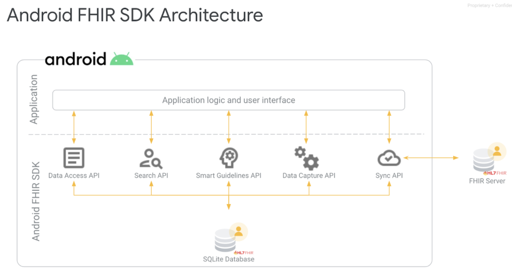
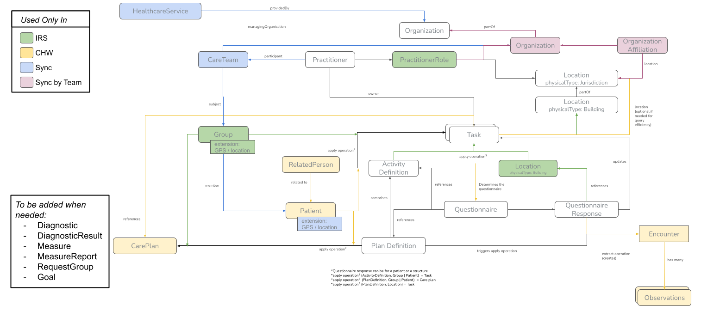
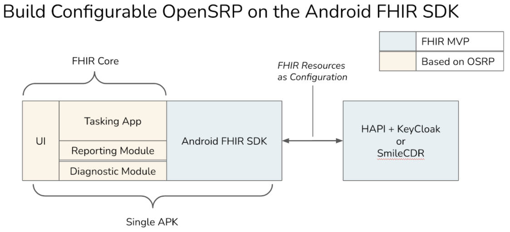
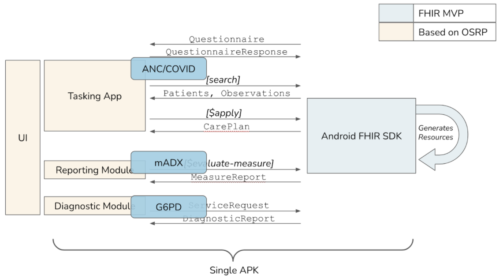
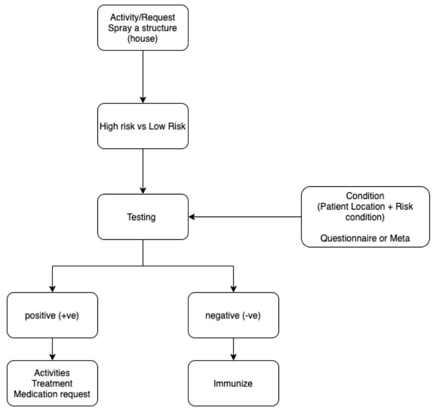

## Proposed Solution

### The Android  FHIR SDK will comprise of the following key modules
1. Data Access API - Set of APIs for performing CRUD operations on FHIR resources in the SQLite DB
2. Search API - On-device fluent search API allows application to compose complex search queries to filter FHIR resources and build lists
3. Smart Guidelines/ Protocols API(?) - Building blocks for deploying implementation guides (IGs) including Smart Guidelines
4. Data Capture API - SDC specification implementation- The structure data capture library will render Android UI from FHIR questionnaire resources.
5. Sync API - Provides sync capabilities between a FHIR server and the local DB

### Other additional components will include
1. CQL API - Provide support for operations and execution of CQL logic
2. Utilities - Can be used to generate widget functionality for the app

### Core SDK demo
* Common use case for a CHW app. Incorporates MVP elements from the SDK
* MVP server side components for reference application (Ona to own)

### SDC Gallery App
* specifically for rendering a FHIR Questionnaire

### Reference app
* currently displaying a list view with FHIR patient resources  

### Common Features
1. Patient registration
2. Patient search
3. Patient profile view
4. Offline Sync support
5. Multilingual support

### Covax specific features
1. Vaccination registration
2. Vaccination certificate support
G6PD specific features
1. Image processing engine (IPE)
2. Results interpretation module (RIM)

### FHIR Resource Graph

We plan to structure FHIR resources as shown in the below diagram:

### Extended capability to
1. Execute CQL logic
2. Generate CarePlan
3. Sync data with FHIR server

### Set of helper functions to
1. Search
2. Validate
3. Interact with CarePlans and Activities

### Apply Operation
TBC

### Plan Definition
* Main unit of the business logic. Inside you will find the triggers . Give us the care plans and the resource group.
* A definition canonical reps the activity definition to recommended supplements/medication in this use case
NB.  Inside the Activity definition we shall define what we need to create based on the plan definition. Logic will come from the CQL which will be running additional queries.
* Inside actions , we get the triggers and conditions that reference the CQL expressions in the ANC CQL lib.
* The library filed will specify which CQl lib will be used and can reference multiple libraries
* Jurisdiction identifies where the plan is valid
* There is a goal for each plan definition and its id is unique  - Goals may address the prevention of illness, cure or mitigation of a condition, prolongation of life, or mitigation of pain and discomfort.

### Flow of work
* Create a Plan
  * Has a set of Actions (Activities)
     * Contains a list of sub-actions (what is to be done)
* Generating actions can be implemented via
   * Inline actions (No activity definition attached) or directly using Activity definitions
   * Action can be implemented as a:
      * Code
      * Link to questionnaire
      * Property to get an action
   * An ApplyOperation on a plan will generate a care plan -> Set of activities on an individual
   * We can have a group of resources to attach to a household
      * Logic can be embedded in the plan definition
      * CarePlan will be against the house (head of household) or patient (target context)

### Example: Generating a plan for  IRS

### How to go about it/ Implementation paths
1. Create a task beforehand
2. Daisy-chaining  - using  Dynamic values - dynamic calculation of values
   1. Treatment  - if conduction is +positive within 3 months
      1. Path (Status) - > Resource or task
      2. Expression  (Active)

### Backend operations
1. Create a Plan definition
2. Define a Plan selector
3. Sync to phone

### Scheduling
* Run evaluation after a questionnaire response is submitted or periodic trigger based on a schedule

### CQL
Getting started with CQL

### CQF-Ruler[a]
Task generation on CQF-Ruler as alternative of extending plan evaluator

[a]1. How will CQL be used to invoke these operations
2. Which CQL lib, CQF ruler, in-app vs server-side?
