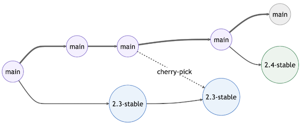

# Releases

OpenSRP FHIR Core releases occur at most once every 2 weeks, i.e. at the conclusion of a sprint. The release process follows the [gitlab flow](https://docs.gitlab.com/ee/topics/gitlab_flow.html#release-branches-with-gitlab-flow) style described in the following diagram:



This allows changes to occur on the code release branch while unrelated code continues being merged into main.

## Release notes

Release notes provide a summary of the changes, improvements, and bug fixes in each new release. They are an essential resource for developers and users to understand what has been updated and any potential impacts on their implementations.

### How to write release notes

To write effective release notes, follow these guidelines:

1. **Be concise and clear:** Summarize the changes in a way that is easy to understand by users and developers.
2. **Categorize changes:** Group changes into categories like 'New Features', 'Improvements', and 'Bug Fixes' for easy navigation.
3. **Highlight breaking changes:** Clearly indicate any breaking changes that may impact existing implementations or require special attention.
4. **Include relevant issue numbers:** Link to the related GitHub issues or pull requests for more context and easier tracking.

### Adding release notes to the repository

Before a new release is created, the release notes must be added to the [changelog](https://github.com/opensrp/fhircore/blob/main/CHANGELOG.md). The changelog is ordered from newest release at the top to oldest releases at the bottom. Follow these steps to add a changelog entry for your new release:

1. Update, verify, add to the latest changelog section
    * If there is an "unreleased" header, update this to the new release version following the document format
    * If there is no "unreleased" header, add one for this new release version
2. Update and add to the release notes in this section following the guidelines mentioned above.
    * At a minimum, the release notes must link to and include the title text from the the newly closed issues, excluding any testing, doc, or cleanup issues that are uninformative or immaterial to the changes.
3. Commit and open a PR for your updates to the changelog.

### Viewing release notes

Release notes can be viewed in the [changelog](https://github.com/opensrp/fhircore/blob/main/CHANGELOG.md).

## Code releases

To conduct a code release follow the below steps:

1. Open and merge a PR to update the project version to the current release version
    * e.g. change the `versionName` in the Quest [build.gradle](https://github.com/opensrp/fhircore/blob/main/android/quest/build.gradle#L28) file to `v0.2.0`
1. Code freeze: create a branch for the code release version as well as the first code release candidate (labeled RC1).
    * For example, for code release version `v0.2.0`, create a branch `opensrp-0.2.0`, a pre-release `opensrp-0.2.0-rc1`, and a tag `opensrp-0.2.0-rc1`
1. Candidate progression: This is followed by 1-2 weeks of QA and error fixing
    * Whenever we find an error in the candidate, open a pull request with a fix for the error against the code release branch (e.g.  `v0.2.0`)
    * Once the error is fixed and merged into the code release branch (multiple errors can be batched), create a new tag, e.g. `opensrp-0.2.0-rc2`, the update the pre-release to point to this tag and reflect the RC2 name.
    > You must also either a) open a PR with the same fix against the `main` branch, b) open a PR from the release branch into the `main` branch after merging the fix into the release branch.
1. Repeat step (2.) until QA passes, e.g. with more tags, e.g. `opensrp-0.2.0-rc3` ..., and updated pre-releases.
1. Final code release: when the release passes QA, create a final release tag `v0.2.0` and update the release to point to this tag and reflect the `opensrp-0.2.0` name.

## APK releases

Once a final code release is created, attach a generic flavor APK release e.g. `opensrp-0.2.0.apk` to the release. In addition, attach APK releases for any specific flavors requested, e.g. `opensrp-0.2.0-bunda.apk`, `opensrp-0.2.0-ecbis.apk`, `opensrp-0.2.0-wdf.apk`.

## Flavors

Flavors define custom names, icons, and default local properties (such as server versions). We use flavors when a particular project or use-cases requires this customization, such as a branded icon and name. When creating flavors do NOT include version numbers. The version of the flavor is defined by the code version.

To add a flavor, add an entry to the `productFlavors` map in [`android/quest/build.gradle`](https://github.com/opensrp/fhircore/blob/main/android/quest/build.gradle). For example, to add a flavor called `new-flavor` add the map:

```
new-flavor  {
    dimension "apps"
    applicationIdSuffix ".new-flavor"
    versionNameSuffix "new-flavor"
}
```

You can add the follow resources:

Description|Location
---|---
App icon|`android/quest/src/new-flavor/res/drawable/ic_app_logo.png`
App name|`android/quest/src/new-flavor/res/values/strings.xml`

Where the app icon is an image of the appropriate size and the app name is an XML file with the following content:

```
<resources>
    <string name="app_name" translatable="false">New Flavor App Name</string>
    <string name="authenticator_account_type" translatable="false">org.smartregister.fhircore.new-flavor</string>
</resources>
```

## Release automation with tags

As part of integrating Continuous Delivery(CD) into the development lifecycle, CI is set up to generate an APK.

The configuration requires the tag to:
* The product name: _opensrp_
* Followed by the _version_ in the format `[0-9]+.[0-9]+.[0-9]+[0-9a-zA-Z.-]+`
* Followed by an optional _suffix_ depending on the release e.g. `-alpha`, `-rc`, `-beta` e.t.c

The following are all valid tags that will trigger the generation of a release APK
> - opensrp-1.2.0
> - opensrp-1.2.0-alpha
> - opensrp-1.2.0-beta
> - opensrp-1.2.0-rc1

**Note:** e.g. when creating a tag for the _OpenSRP Version 1.2.0_, use the command:

```
git tag -a opensrp-1.2.0 -s  && git push origin opensrp-1.2.0
```

When you run the command, you will be prompted to _add a message_. The message should be of the format:

| Template                                                       | Sample                                                                                                            |
|----------------------------------------------------------------|-------------------------------------------------------------------------------------------------------------------|
| <pre> TITLE <br/> - Release note 1<br/> - Release note 2</pre> | <pre> BETA RELEASE <br/> - Adds Login by PIN functionality <br/> - Fixes sync bug causing crash on install </pre> |

**Note:** For convention, the TITLE should be _Capitalized_.

### Deleting a tag
Sometimes you may want to delete a tag, e.g. if you push an incorrect tag, need to update the tag message etc.

For example, to delete the opensrp-1.2.0 tag run the command:

```
git push --delete origin opensrp-1.2.0 && git tag --delete opensrp-1.2.0
```
