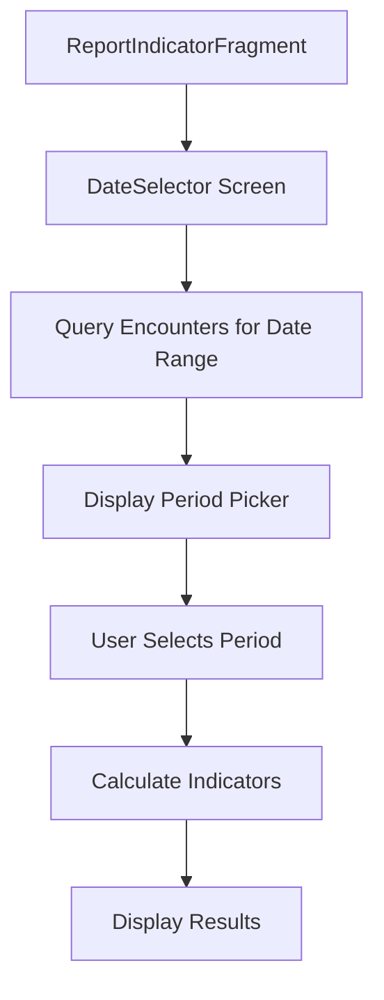

# Indicator Reports

Indicator reports provide a lightweight, configuration-driven approach to generating health metrics without requiring Clinical Quality Language (CQL). This feature enables date-based filtering of FHIR resources using Encounters as the temporal anchor.


## How It Works

### User Flow

1. User navigates to Indicator Reports
2. System queries Encounters to find available date range
3. User selects a period (month or full year) from the date picker
4. System calculates indicators for the selected period
5. Results are displayed with counts

### Technical Flow



### Date Range Discovery

The system automatically discovers available date ranges by querying Encounters:

```kotlin
// Find earliest Encounter
search<Encounter> {
  sort(StringClientParam("date"), Order.ASCENDING)
  count = 1
}

// Find latest Encounter
search<Encounter> {
  sort(StringClientParam("date"), Order.DESCENDING)
  count = 1
}
```

This generates a list of months between the earliest and latest Encounter dates, grouped by year. Users can select individual months or entire years.

### Date-Filtered Queries

When a month is selected:

1. System calculates first and last day of the month
2. Dates are added to the `computedValues` map as `startDate` and `endDate`
3. Searches are executed with these date filters applied

```kotlin
computedValues["startDate"] = "2024-01-01"
computedValues["endDate"] = "2024-01-31"
```

## Configuration

### Basic Structure

```json
{
  "appId": "app",
  "configType": "reportIndicator",
  "id": "monthly-health-indicators",
  "title": "Monthly Health Indicators",
  "description": "Monthly health service delivery indicators",
  "indicators": [
    {
      "id": "indicator-id",
      "title": "Indicator Title",
      "subtitle": "Indicator description",
      "resourceConfig": {
        "resource": "ResourceType",
        "dataQueries": [],
        "nestedSearchResources": []
      }
    }
  ]
}
```

### Configuration Properties

| Property | Type | Required | Description |
|----------|------|----------|-------------|
| `appId` | String | Yes | Application identifier |
| `configType` | String | Yes | Must be `"reportIndicator"` |
| `id` | String | Yes | Unique identifier for the report |
| `title` | String | Yes | Display title for the report |
| `description` | String | No | Description of the report |
| `indicators` | Array | Yes | List of indicator configurations |

### Indicator Properties

| Property | Type | Required | Description |
|----------|------|----------|-------------|
| `id` | String | Yes | Unique identifier for the indicator |
| `title` | String | Yes | Display title |
| `subtitle` | String | No | Additional description |
| `resourceConfig` | Object | Yes | Resource query configuration |

## Configuration Patterns

### Pattern 1: Count Patients with Specific Encounters

This pattern counts unique patients who had specific types of encounters in the date range.

```json
{
  "id": "anc-patients",
  "title": "ANC Patients",
  "subtitle": "Patients with ANC visits this month",
  "resourceConfig": {
    "resource": "Patient",
    "nestedSearchResources": [
      {
        "resourceType": "Encounter",
        "referenceParam": "subject",
        "dataQueries": [
          {
            "paramName": "date",
            "filterCriteria": [
              {
                "dataType": "DATETIME",
                "computedRule": "startDate",
                "prefix": "GREATERTHAN_OR_EQUALS"
              },
              {
                "dataType": "DATETIME",
                "computedRule": "endDate",
                "prefix": "LESSTHAN_OR_EQUALS"
              }
            ],
            "operation": "AND"
          },
          {
            "paramName": "type",
            "filterCriteria": [
              {
                "dataType": "CODE",
                "value": {
                  "system": "http://terminology.hl7.org/CodeSystem/encounter-type",
                  "code": "anc-visit",
                  "display": "ANC Visit"
                }
              }
            ]
          }
        ]
      }
    ]
  }
}
```

**FHIR Search Equivalent:**
```
GET /Patient?_has:Encounter:subject:period=ge2024-01-01
  &_has:Encounter:subject:period=le2024-01-31
  &_has:Encounter:subject:type=anc-visit
```

### Pattern 2: Count Encounters Directly

This pattern counts encounters of a specific type within the date range.

```json
{
      "id": "indicator1",
      "title": "Number of households",
      "resourceConfig": {
        "resource": "Encounter",
        "dataQueries": [
          {
            "paramName": "date",
            "filterCriteria": [
              {
                "dataType": "DATETIME",
                "computedRule": "startDate",
                "prefix": "GREATERTHAN_OR_EQUALS"
              },
              {
                "dataType": "DATETIME",
                "computedRule": "endDate",
                "prefix": "LESSTHAN_OR_EQUALS"
              }
            ],
            "operation": "AND"
          },
          {
            "paramName": "class",
            "filterCriteria": [
              {
                "dataType": "CODE",
                "value": {
                  "code": "HH",
                  "system": "http://terminology.hl7.org/CodeSystem/v3-ActCode"
                }
              }
            ]
          }
        ]
      }
    }
```

### Pattern 3: Count Resources with Date Fields

For resources that have their own date fields (Immunization, Observation):

```json
{
  "id": "immunizations",
  "title": "Immunizations",
  "subtitle": "Immunizations administered",
  "resourceConfig": {
    "resource": "Immunization",
    "dataQueries": [
      {
        "paramName": "date",
        "filterCriteria": [
          {
            "dataType": "DATETIME",
            "computedRule": "startDate",
            "prefix": "GREATERTHAN_OR_EQUALS"
          },
          {
            "dataType": "DATETIME",
            "computedRule": "endDate",
            "prefix": "LESSTHAN_OR_EQUALS"
          }
        ],
        "operation": "AND"
      },
      {
        "paramName": "status",
        "filterCriteria": [
          {
            "dataType": "CODE",
            "value": {
              "code": "completed"
            }
          }
        ]
      }
    ]
  }
}
```

### Pattern 4: Patients with Related Resources

Count patients who have specific related resources in the date range:

```json
{
  "id": "immunization-patients",
  "title": "Immunization Patients",
  "subtitle": "Children immunized this month",
  "resourceConfig": {
    "resource": "Patient",
    "nestedSearchResources": [
      {
        "resourceType": "Immunization",
        "referenceParam": "patient",
        "dataQueries": [
          {
            "paramName": "date",
            "filterCriteria": [
              {
                "dataType": "DATETIME",
                "computedRule": "startDate",
                "prefix": "GREATERTHAN_OR_EQUALS"
              },
              {
                "dataType": "DATETIME",
                "computedRule": "endDate",
                "prefix": "LESSTHAN_OR_EQUALS"
              }
            ],
            "operation": "AND"
          },
          {
            "paramName": "status",
            "filterCriteria": [
              {
                "dataType": "CODE",
                "value": {
                  "code": "completed"
                }
              }
            ]
          }
        ]
      }
    ]
  }
}
```


## Reference Tables

### Computed Rules

The following computed rules are automatically available in all indicator configurations:

| Rule Name | Type | Format | Description |
|-----------|------|--------|-------------|
| `startDate` | String | `YYYY-MM-DD` | First day of selected month |
| `endDate` | String | `YYYY-MM-DD` | Last day of selected month |

### Date Prefixes

| Prefix | Operator | Description |
|--------|----------|-------------|
| `GREATERTHAN_OR_EQUALS` | `>=` | Greater than or equal to (use for start dates) |
| `LESSTHAN_OR_EQUALS` | `<=` | Less than or equal to (use for end dates) |
| `EQUAL` | `=` | Exact match |
| `GREATERTHAN` | `>` | Greater than |
| `LESSTHAN` | `<` | Less than |

### Operations

| Operation | Description |
|-----------|-------------|
| `AND` | All filter criteria must match |
| `OR` | Any filter criteria can match |

### Resource Date Parameters

| Resource | Date Parameter | Notes |
|----------|---------------|-------|
| `Encounter` | `period` | Primary temporal anchor for most indicators |
| `Immunization` | `date` | Direct date field |
| `Observation` | `date` | Direct date field |
| `Condition` | `recorded-date` or `onset-date` | Choose based on use case |
| `Procedure` | `date` | Direct date field |
| `MedicationRequest` | `authoredon` | When prescription was created |
| `CarePlan` | `period` | Care plan period |
| `ServiceRequest` | `authored` | When request was created |

## Reverse Chaining Explained

Reverse chaining allows you to filter resources based on related resources. This is achieved using the `nestedSearchResources` configuration.

### How It Works

When you configure:

```json
{
  "resource": "Patient",
  "nestedSearchResources": [
    {
      "resourceType": "Encounter",
      "referenceParam": "subject",
      "dataQueries": [...]
    }
  ]
}
```

The system generates a FHIR search that finds Patients who have related Encounters matching the specified criteria.

This is powerful because:
- FHIR resources don't have a standard `createdAt` field
- Encounters contain the temporal information via `period`
- You can count unique patients rather than just encounters
- Supports complex filtering on related resources


**When to use Indicator Reports:**
- Simple resource counting
- Monthly service statistics
- Quick dashboards
- Basic filtering by date/type/status
