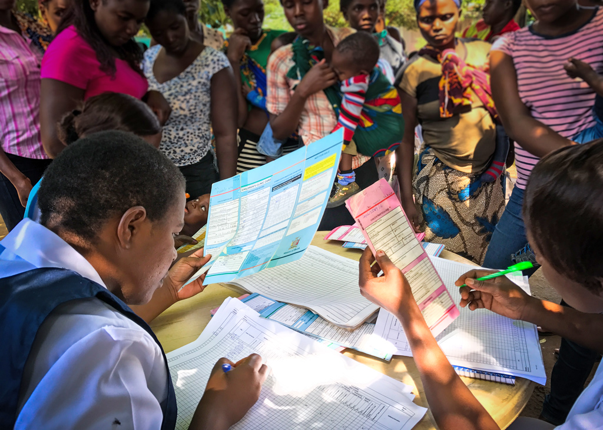

# History

## Overview 

As an organization we fundamentally believe technology can play a critical role to empower and augment the capabilities of frontline health workers to help them serve. This is critical to overcoming the significant shortage in highly skilled medical professionals that most countries face. Digitally empowered frontline health workers are essential if we want to achieve a more universal, equitable and affordable access to health services.

Affordable, basic health care such as child immunizations, maternal care, malaria, HIV, and family planning in low resource countries can:

* **Improve health outcomes:** By providing access to necessary medical treatments and management, individuals are able to better control their condition and receive lifesaving care, reducing the risk of complications and improving overall health.
* **Prevent disease progression**: Early detection and management of health issues can prevent the progression of the issue, reducing the risk of complications and improving health outcomes.
* **Reduce poverty**: The cost of managing serious health issues can be significant, and without access to affordable healthcare, many individuals may fall into debt or poverty as a result of medical expenses.
* **Promote economic development**: Improved health outcomes can lead to increased productivity, thereby promoting economic development.
* **Reduce inequality**: Access to healthcare is often limited for marginalized communities, exacerbating existing inequalities. Providing affordable healthcare can help reduce these disparities.

In summary, access to affordable and effective care for both chronic, acute and preventative conditions is critical to help ensure the overall health, economic and general well being of people around the world. Technology that supports patient centered care can play one important step in helping achieve this.

## The "smart" register 

OpenSRP is designed to be highly intuitive and based on existing paper tools in an effort to be easy to learn by existing health workers.

The paper register is a common health team tool in low resource countries. These books are easy to print and follow a simple tabular format that guides the health care practitioner through a series of inputs. However, paper's downsides — being strictly a data entry that's hard to extract or share information out of, and requiring filling in data over and over again in different places — are what digital health tries to overcome.

<figure><figcaption>
Health workers in Zambia recording health information in multiple places while a crowd of new mothers watches and waits.
</figcaption></figure>

We discovered that a major obstacle in the successful adoption of technology is the first few months of adapting and learning a new platform.

We used the format paper register, which was easy to scan and understand, and upgraded it to be "smart". First, we added "tasks" which are assigned to-do's for health practitioners, which helps them track when services are due and easily see who is overdue. Next, we added some simple checks to make sure data was entered correctly, and offered solutions and decision support for health issues that arise.

OpenSRP supports health done in the right way, with less focus on rote data collection, and more focus on providing quality care. The software is meant to provide a speedy and helpful user experience where usability is king.

## More about OpenSRP FHIR 

**Blog articles**

* [​​Eight reasons why FHIR is important for global health](https://ona.io/home/eight-reasons-why-fhir-is-important/)
* [​​Powering interoperability with a FHIR to DHIS2 adapter](https://github.com/opensrp/fhircore/blob/rw-pld-gitbook-sync/docs/readme/history/#overview)

**Videos**



**News**

* [Case study celebrates lessons and catalytic potential of rapid, iterative software development across three countries](https://bidinitiative.org/blog/case-study-celebrates-lessons-and-catalytic-potential-of-rapid-iterative-software-development-across-three-countries/)
* [OpenSRP named a Global Good by Digital Square](https://ona.io/home/opensrp-named-a-global-good-by-digital-square/)
* [Integration Between MEDSINC and OpenSRP will Link Community-Level Clinical Data with National Health Information Systems](https://www.businesswire.com/news/home/20180130005503/en/Integration-Between-MEDSINC-and-OpenSRP%C2%A0will-Link-Community-Level-Clinical-Data-with-National-Health-Information-Systems)
* [The WHO Family Planning Reference App built on OpenSRP](https://fpdigitalsolution.org/case-study/the-who-family-planning-reference-app-built-on-opensrp/#introduction)
* [OpenSRP is a 2018 Gavi Pacesetter](https://ona.io/home/opensrp-is-a-2018-gavi-pacesetter/)
